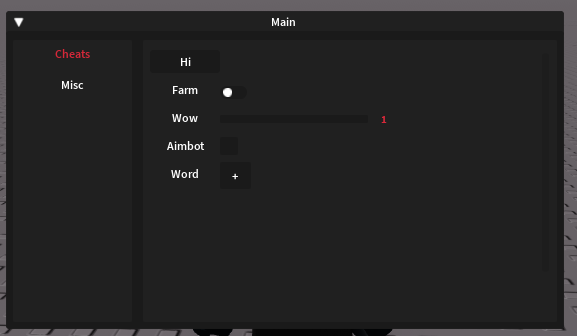
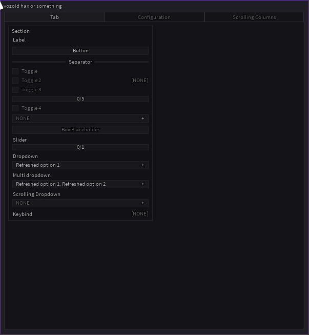

# Roblox UI Libraries ()

###### Credits: [Weakhoes](https://github.com/weakhoes/Roblox-UI-Libs)

  

## Abyss Lib

  
  

## Akiri Lib

  
  

## Bracket Lib

## Cerberus Lib

## Criminality Lib

## Discord Lib

## Elerium [IMGUI]

## Fluent Lib

## Flux Lib

## GameSneeze Lib

## Hydra Lib

## informant.wtf 

  
  

## Jan Lib

## Linoria Lib

## Luminosity Lib

## Mercury Lib

## Octernal Lib

## Orion Lib

## Pepsi's UI Library

## PPHud Lib

## Rayfield Lib

## Shadow Lib

## Splix Lib

## Tokyo Lib

  

## Vanis Lib

## Venus Lib

## Void Lib

## Xsx Lib

## Yun V2 Lib

